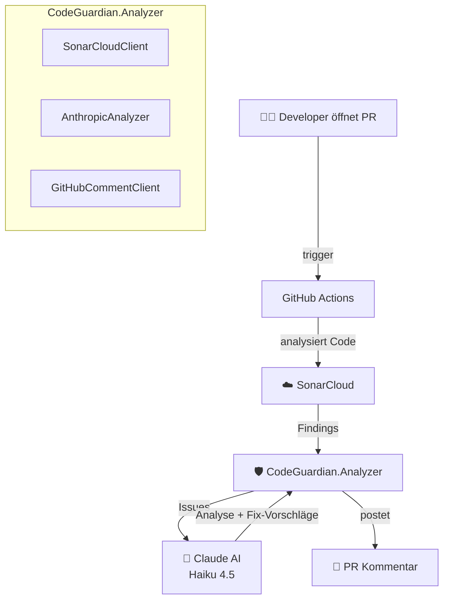

# 🛡️ CodeGuardian

> *"There is no perfect code. But CodeGuardian gets you closer."*

**CodeGuardian** ist ein KI-gestützter Code Review Agent der SonarCloud Findings automatisch analysiert und als Kommentar in GitHub Pull Requests postet.
Der Traum: Code der sich selbst heilt – CodeGuardian ist der erste Schritt dorthin. 🤖

---

## 💡 Die Idee

Selbstheilender Code beginnt damit dass Probleme **sofort sichtbar** werden – nicht erst beim nächsten manuellen Review.
CodeGuardian verbindet SonarCloud Analyse mit Claude AI und macht jeden Pull Request zu einem lehrreichen Erlebnis:

```
PR öffnen → SonarCloud analysiert → Claude erklärt → Kommentar im PR
```

Kein separater Server. Keine Konfiguration pro Projekt. Einmal einrichten, überall nutzen.

---

## 🗺️ Architektur



---

## 🚀 Voraussetzungen

- [.NET 9 SDK](https://dotnet.microsoft.com/download)
- [SonarCloud Account](https://sonarcloud.io) ← kostenlos für Public Repos
- [Anthropic API Key](https://console.anthropic.com) ← ca. $0.015 pro Analyse
- GitHub Repository mit Actions aktiviert

---

## ▶️ Einrichten in deinem Projekt

### 1. Secrets anlegen

In deinem Repository → **Settings** → **Secrets and variables** → **Actions**:

| Secret | Beschreibung |
|--------|-------------|
| `SONAR_TOKEN` | SonarCloud Token aus **My Account → Security** |
| `ANTHROPIC_API_KEY` | Anthropic API Key aus **console.anthropic.com** |
| `GITHUB_TOKEN` | Wird automatisch von GitHub bereitgestellt ✅ |

### 2. Variables anlegen

In deinem Repository → **Settings** → **Secrets and variables** → **Variables**:

| Variable | Beschreibung |
|----------|-------------|
| `SONAR_PROJECT_KEY` | z.B. `lady-logic_MeinProjekt` |
| `SONAR_ORGANIZATION` | z.B. `lady-logic` |

### 3. sonar-project.properties anlegen

Im Root-Ordner deines Projekts:

```properties
sonar.projectKey=DEIN_PROJECT_KEY
sonar.organization=DEINE_ORGANIZATION
sonar.sources=.
sonar.exclusions=**/bin/**,**/obj/**,**/Migrations/**
```

### 4. GitHub Actions Workflow anlegen

Erstelle `.github/workflows/codeguardian.yml`:

```yaml
name: 🛡️ SonarCloud + CodeGuardian

on:
  pull_request:
    branches: [ main ]

jobs:
  sonarcloud:
    name: SonarCloud Scan
    runs-on: ubuntu-latest
    steps:
      - uses: actions/checkout@v4
        with:
          fetch-depth: 0

      - name: Setup .NET
        uses: actions/setup-dotnet@v4
        with:
          dotnet-version: '9.0.x'

      - name: Build
        run: dotnet build

      - name: SonarCloud Scan
        uses: SonarSource/sonarcloud-github-action@master
        env:
          GITHUB_TOKEN: ${{ secrets.GITHUB_TOKEN }}
          SONAR_TOKEN: ${{ secrets.SONAR_TOKEN }}

  codeguardian:
    name: 🤖 CodeGuardian AI Review
    runs-on: ubuntu-latest
    needs: sonarcloud
    permissions:
      pull-requests: write
      issues: write

    steps:
      - name: Checkout CodeGuardian
        uses: actions/checkout@v4
        with:
          repository: lady-logic/CodeGuardian
          path: codeguardian

      - name: Setup .NET
        uses: actions/setup-dotnet@v4
        with:
          dotnet-version: '9.0.x'

      - name: Run CodeGuardian
        env:
          ANTHROPIC_API_KEY: ${{ secrets.ANTHROPIC_API_KEY }}
          SONAR_TOKEN: ${{ secrets.SONAR_TOKEN }}
          GITHUB_TOKEN: ${{ secrets.GITHUB_TOKEN }}
          GITHUB_REPOSITORY: ${{ github.repository }}
          PR_NUMBER: ${{ github.event.pull_request.number }}
        run: |
          dotnet run \
            --project codeguardian/src/CodeGuardian.Analyzer/CodeGuardian.Analyzer.csproj \
            -- ${{ vars.SONAR_PROJECT_KEY }}
```

---

## 💬 Beispiel PR Kommentar

```
🛡️ CodeGuardian Analysis

**Zusammenfassung:** Es wurden 3 Issues gefunden – 1 Bug und 2 Code Smells.

**🔴 BUG – Zeile 42, NasaApiClient.cs**
Mögliche NullReferenceException wenn die API keine Daten zurückgibt.

Fix-Vorschlag:
  var result = response?.Data ?? new List<NeoWsObject>();

**🟡 CODE SMELL – Zeile 87, Program.cs**
Methode ist zu lang (> 30 Zeilen). Aufteilen in kleinere Methoden empfohlen.

Weiter so! Sauberer Code ist selbstheilender Code. 🚀

---
Powered by CodeGuardian + Claude AI
```

---

## 💰 Kosten

CodeGuardian nutzt **Claude Haiku 4.5** – das günstigste Modell:

| Szenario | Kosten pro Analyse |
|----------|-------------------|
| 5 Issues | ~$0.008 |
| 20 Issues | ~$0.015 |
| 100 PRs/Monat | ~$1.50 |

---

## 🛣️ Roadmap

- [x] **v1.0** – SonarCloud + Claude + GitHub PR Kommentar
- [ ] **v2.0** – Automatischer Fix-PR statt nur Kommentar
- [ ] **v3.0** – Selbstheilender Code – Agent öffnet und mergt Fix-PRs autonom

---
